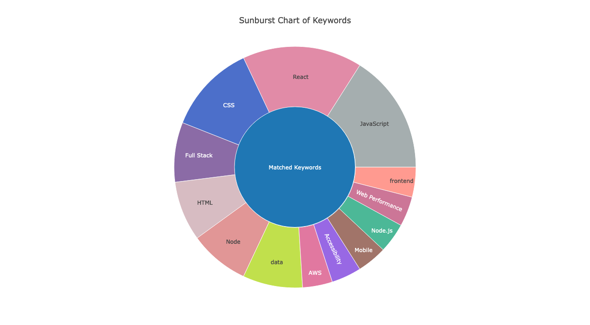
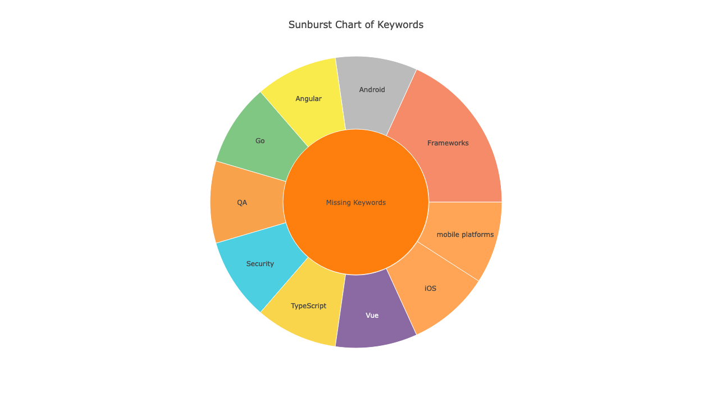

# Keywordify
Have you ever job searched for 6 months+?
That's me looking for a software engineering gig.

Could it be the market?

Could it be I don't have enough keywords from the job description in my resume?
At least that is testable and fixable.

I decided to write a python script to check.
But even better, write a Flask app to do it too.

Learning Flask as I go. So here we go!

# TECH
- Python
- Flask
- Plotly

# HOW TO USE
1. Save a job description as a txt file
2. Save your resume as a txt file
3. Upload each to the site.
4. See the results and rewrite your resume away

## Todo
0. ~~Deploy to Render~~
1. Add style
2. ~~Use Plotly etal to make a cooler visual for keyword analysis~~
3. Add PDF as option, + copy and paste, for adding job description and resume.
4. View current keywords + option to add to list
5. Add ML component with Tensor Flow to get new keywords off of the job descriptions that are uploaded
6. Connect mySQL db to save new keywords for list, and overall data, etc.
7. Build login to save your resume (can Render do SQLite from just their web services plan?)

